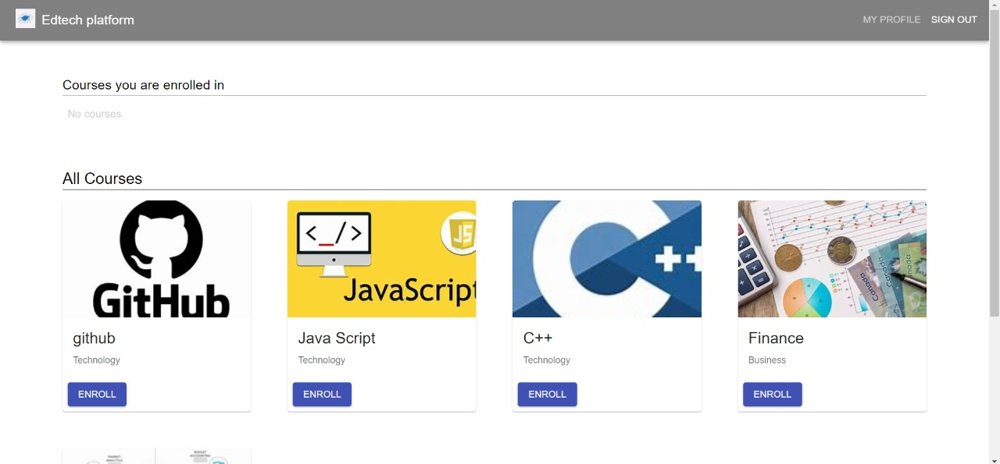
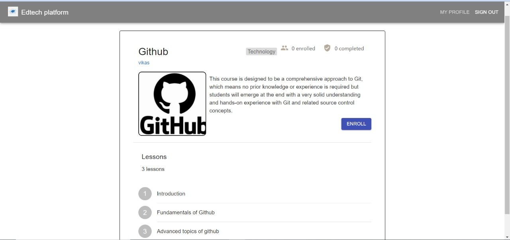
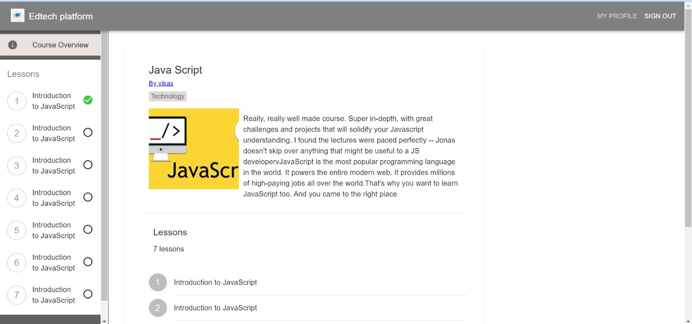
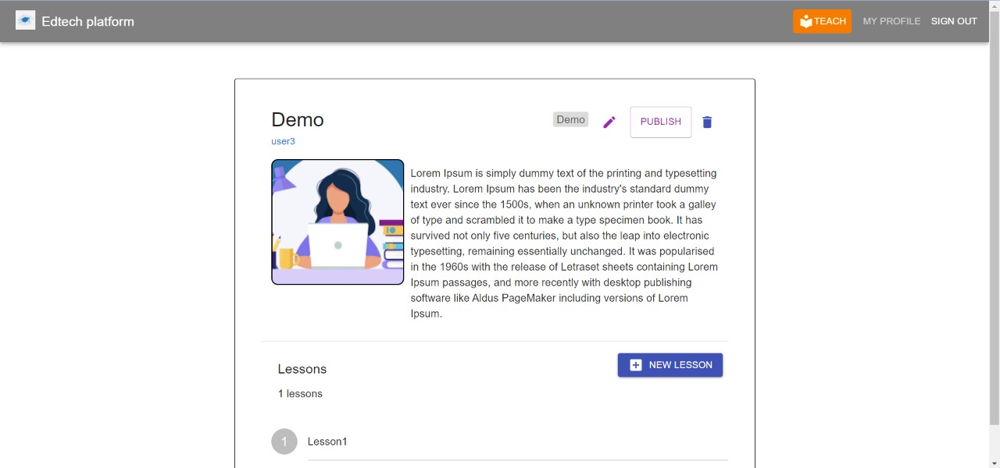
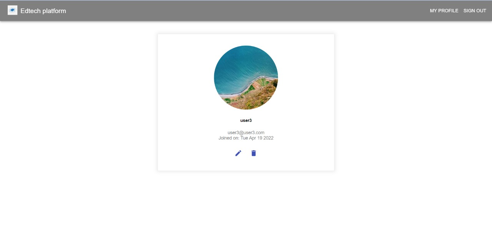

 # Edtech-platform [[link](https://ed-techies.herokuapp.com/)]
A simple web-based ed=tech platform that allows instructors to add courses with lessons, while students can enroll in these courses and track their progress- developed using React, Node, Express and MongoDB.


## Tech Stack
MERN stack<br/>
Bootstrap5

##  How to run this code
- [x] Make sure MongoDB is running on your system
- [x] Clone this repository
- [x] Open command line in the cloned folder,
   - To install dependencies, run ```  npm install  ``` or ``` yarn ```
   - To run the application for development, run ```  npm run development  ``` or ``` yarn development ```

## Demo images
### Home page -
<p align="center">

</p>
<br/>
<br/>

### Course description -
<p align="center">

</p>
<br/>
<br/>

### Course page for enrolled user -
<p align="center">

</p>
<br/>
<br/>

### Add a course page -
<p align="center">

</p>
<br/>
<br/>

### All courses for a techaer -
<p align="center">

</p>
<br/>
<br/>

### Profile page -
<p align="center">

</p>
<br/>
<br/>
